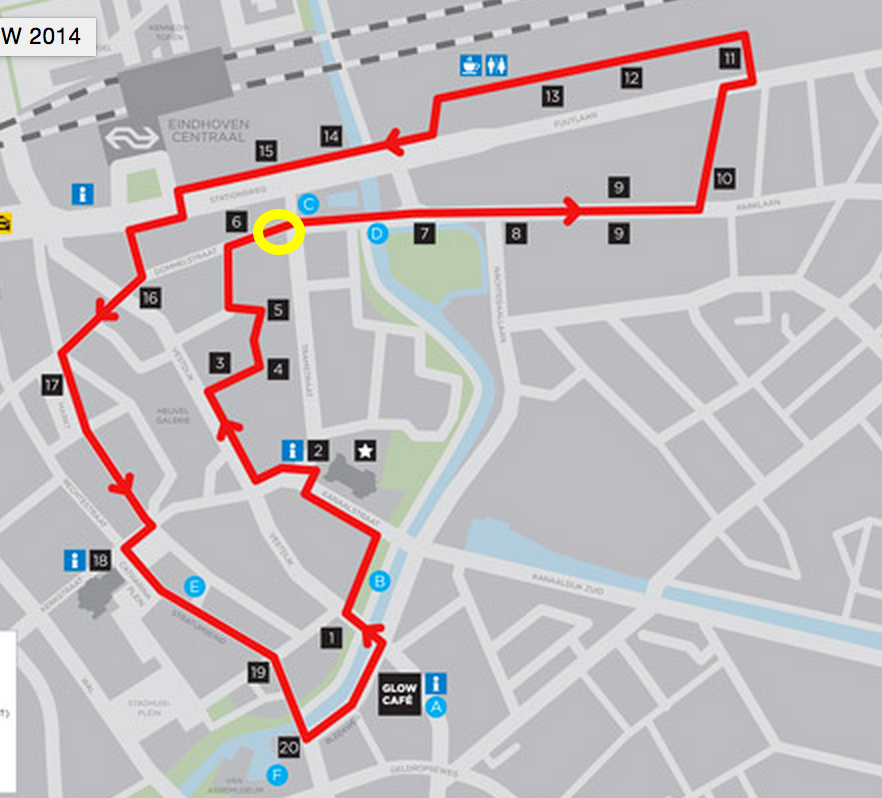
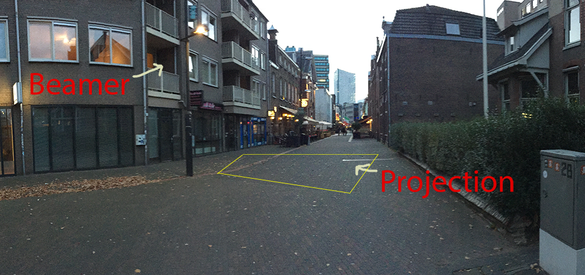

Glow 2014
========

Hello everybody,

Next saturday is the start of Glow. And the route happens to go right in front of my appartment.

It would be a shame to waste this unique opportunity, so I want to install a mini art installation in the Dommelstraat. My idea is to project an interactive toy on the street. It detects people walking by with a Kinect and then draws something cool where they stand.

We have very little time and a lot to do. We still need:

* A beamer (I can borrow a standard beamer at work, but if anyone has access to a high-luminosity, high-resolution beamer that would be awesome)
* A Kinect
* A rig to secure these on my balcony
* Software for calibrating the Kinect, the beamer and doing some perspective-correction math
* Something pretty and interactive to project

You're welcome to join if you want to help with any part of it. Let's get this project started!
